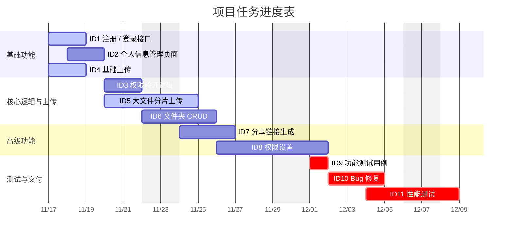

```mermaid
gantt
    title 项目任务进度表
    dateFormat  YYYY/MM/DD
    axisFormat  %m/%d
    excludes    weekends

    section 基础功能
    ID1 注册 / 登录接口       :active,  t1, 2025/11/17, 2025/11/19
    ID2 个人信息管理页面      :         t2, 2025/11/18, 2025/11/20
    ID4 基础上传             :active,  t4, 2025/11/17, 2025/11/19
    
    section 核心逻辑与上传
    ID3 权限验证逻辑          :         t3, 2025/11/20, 2025/11/22
    ID5 大文件分片上传        :active,  t5, 2025/11/20, 2025/11/23
    ID6 文件夹 CRUD          :         t6, 2025/11/22, 2025/11/25
    
    section 高级功能
    ID7 分享链接生成          :         t7, 2025/11/24, 2025/11/27
    ID8 权限设置              :         t8, 2025/11/26, 2025/11/30
    
    section 测试与交付
    ID9 功能测试用例          :crit,    t9, 2025/12/01, 2025/12/02
    ID10 Bug 修复            :crit,    t10, 2025/12/02, 2025/12/05
    ID11 性能测试            :crit,    t11, 2025/12/04, 2025/12/07
```